# Day 1: Back-end Development - Workshop Plan

This document serves as an index for the Day 1 workshop on back-end development for the "CRUD-ka historia przesyłki" (CRUD Package History) project.

## Workshop Structure

```mermaid
graph TD
    A[Day 1: Back-end Development] --> B[Morning Session 1: API Design]
    A --> C[Morning Session 2: Resource Design]
    A --> D[Afternoon Session 1: Microservice Implementation]
    A --> E[Afternoon Session 2: Docker & Testing]
    
    B --> B1[OpenAPI 3.0 Introduction]
    B --> B2[RESTful API Principles]
    B --> B3[API Documentation]
    
    C --> C1[User Account Resource]
    C --> C2[Carrier Resource Design]
    C --> C3[Package Resource Design]
    C --> C4[Package Status Management]
    C --> C5[API Versioning & Authentication]
    C --> C6[Error Handling Patterns]
    
    D --> D1[.NET Core Project Setup]
    D --> D2[Database Setup & Scripts]
    D --> D3[Database Access Layer]
    D --> D4[Controller Implementation]
    D --> D5[Configuration Management]
    
    E --> E1[Structured Logging with Serilog]
    E --> E2[Docker Containerization]
    E --> E3[Unit Testing]
    E --> E4[Integration Testing]
```

## Workshop Schedule

### Day 1 Schedule
- **Morning Session 1 (9:00-10:30)**: Introduction to API Design and OpenAPI 3.0
- **Morning Session 2 (10:45-12:15)**: Designing Carrier and Package Resources
- **Afternoon Session 1 (13:15-14:45)**: .NET Core Microservice Implementation
- **Afternoon Session 2 (15:00-16:30)**: Docker, Logging, and Testing

## Workshop Materials

### Preparation
- [Workstation Setup](day1_workstation_setup.md) - Required software installation and environment verification

### Sessions
1. [Morning Session 1: API Design and OpenAPI 3.0](day1_session1_api_design.md)
2. [Morning Session 2: Resource Design](day1_session2_resource_design.md)
3. [Afternoon Session 1: .NET Core Microservice Implementation](day1_session3_microservice_implementation.md)
4. [Afternoon Session 2: Docker, Logging, and Testing](day1_session4_docker_logging_testing.md)

### Complete Plan
- [Full Day 1 Plan](day1_backend_development_plan.md) - Comprehensive plan with all details

## Key Learning Objectives

By the end of Day 1, participants will be able to:

1. Design a RESTful API using OpenAPI 3.0 specification
2. Implement a .NET Core microservice with proper architecture
3. Set up database access using both Dapper and Entity Framework
4. Implement API versioning and error handling
5. Configure structured logging with Serilog
6. Containerize the application with Docker
7. Write unit and integration tests

## Prerequisites

Participants should have:
- Basic knowledge of C# programming
- Familiarity with web development concepts
- A Windows computer with the required software installed (see [Workstation Setup](day1_workstation_setup.md))

## Resources and References

- [.NET 8 Documentation](https://docs.microsoft.com/en-us/dotnet/core/)
- [ASP.NET Core Documentation](https://docs.microsoft.com/en-us/aspnet/core/)
- [OpenAPI Specification](https://swagger.io/specification/)
- [Docker Documentation](https://docs.docker.com/)
- [Serilog Documentation](https://serilog.net/)
- [Dapper Documentation](https://github.com/DapperLib/Dapper)
- [Entity Framework Core Documentation](https://docs.microsoft.com/en-us/ef/core/)